# qFoldIT Repository Architecture Map

**Audit date:** 2026-08-23  
**Organization:** `qfoldit`  
**Canonical runtime/control plane:** `UEFN-QFOLDIT`  
**Canonical governance kit:** `.github`  
**Canonical evidence / consolidation registry:** `IP-valuation-registry`

## Decision vocabulary

- **KEEP** — independent product, scientific engine, service, knowledge corpus, governance, or historical lineage with a distinct lifecycle.
- **CONSOLIDATE** — same-lifecycle implementation that should move behind an existing canonical runtime/core boundary; preserve provenance until migration gates are complete.
- **ADAPTER** — specialized integration boundary that should stay thin and consume canonical contracts rather than own platform semantics.
- **RETIRE** — legacy/redundant implementation with no unique long-term authority; deletion is gated by parity, CI, provenance, license and rollback evidence.
- **EXPERIMENTAL** — research/prototype lineage kept alive for evidence and controlled evaluation, but not a production authority.

## Full repository map

| Repository | Decision | Canonical role | Primary dependencies / consumers | Migration note |
|---|---|---|---|---|
| `.github` | **KEEP** | Organization governance, reusable conformance, canonical fixtures | all qFoldIT repos | single governance source |
| `.github-private` | **KEEP** | Private operational/governance material | private repos | keep isolated from public governance |
| `UEFN-QFOLDIT` | **KEEP** | Canonical Rust/Tauri control plane, qfoldit-core, Mission Control, MCP/UAG orchestration | UEFN/Verse + scientific adapters + runtimes | primary consolidation target |
| `qfoldit-core` *(inside UEFN-QFOLDIT)* | **KEEP** | Canonical Rust domain contracts and Scientific Action Envelope | UEFN-QFOLDIT + future Rust services | one contract authority |
| `VERSE-RAG` | **KEEP** | Rust knowledge-plane service | UEFN-QFOLDIT, agents, Verse IDE | independent deployable service |
| `UEFN-VERSE` | **KEEP** | Verified Verse corpus / knowledge source | VERSE-RAG, Verse IDE | distinct corpus lifecycle |
| `VERSE-FINE-TUNING` | **EXPERIMENTAL** | Training corpus / pattern tuning experiments | agent and strategy tooling | not runtime authority |
| `UEFN-VERSE-MCP` | **CONSOLIDATE** | UEFN/Verse MCP integration lineage | UEFN-QFOLDIT | migrate runtime ownership into canonical cockpit |
| `UEFN-TOOLBELT` | **CONSOLIDATE** | UEFN capability/tool catalog lineage | UEFN-QFOLDIT | move action-facing tools behind core permissions |
| `UNITY-TOOLBELT` | **ADAPTER** | Unity runtime adapter | UEFN-QFOLDIT / shared UAG | retain engine-specific surface |
| `UNIGINE-TOOLBELT` | **ADAPTER** | UNIGINE runtime adapter | UEFN-QFOLDIT / shared UAG | retain engine-specific surface |
| `WEB-TOOLBELT` | **ADAPTER** | Web runtime adapter | qfoldit.github.io / UEFN-QFOLDIT | shared semantic contract, browser-specific execution |
| `UNREALVIS` | **ADAPTER** | Unreal visualization/runtime lineage | UEFN-QFOLDIT | large visualization body stays decoupled |
| `UEFN-BLENDER-BRIDGE` | **ADAPTER** | Blender ↔ UEFN scene bridge | UEFN-QFOLDIT, WEB/UEFN adapters | standalone bridge is useful |
| `GAME-WS-SERVER` | **ADAPTER** | Realtime runtime transport candidate | client/runtime adapters | converge on UAG/Event transport |
| `FOLDIT-REMOTE-CONTROL` | **KEEP** | Historical Foldit remote-interaction lineage | UEFN-QFOLDIT, Foldit workflows | preserve provenance, do not duplicate semantics |
| `mmos-sdk-js` | **ADAPTER** | Legacy JS/MMOS integration surface | web/game services | retain only as compatibility boundary |
| `qFold` | **KEEP** | Classical/quantum folding scientific engine | qFold-MCP, scientific workflows | independent scientific lifecycle |
| `QuPepFold` | **EXPERIMENTAL** | Quantum protein-folding research lineage | qFold / quantum adapters | benchmark before production promotion |
| `quantum-folding` | **EXPERIMENTAL** | Quantum folding experiments | qFold / quantum adapter family | preserve reproducibility |
| `quantum-protein-structure-prediction` | **EXPERIMENTAL** | Quantum protein structure research | qFold / quantum adapter family | no runtime authority |
| `quantum-computing-exploration-for-drug-discovery-on-aws` | **EXPERIMENTAL** | AWS quantum/drug-discovery research | future quantum adapter | isolate provider-specific assumptions |
| `AWS-Deploy` | **CONSOLIDATE** | Historical deployment/provisioning layer | runtime services | converge on a single deploy/IaC layer |
| `Protein-Design-MCP` | **ADAPTER** | Protein design domain adapter | UEFN-QFOLDIT / qfoldit-core | domain logic behind canonical contracts |
| `Protein-MCP` | **ADAPTER** | Protein engineering domain adapter | UEFN-QFOLDIT | specialized workflows remain separate |
| `Atomic-MCP` | **ADAPTER** | Atomistic/material domain adapter | UEFN-QFOLDIT | domain logic behind canonical contracts |
| `Atomic-Calculations` | **KEEP** | Atomistic calculation engine/source lineage | Atomic-MCP | preserve scientific compute authority |
| `qFold-MCP` | **ADAPTER** | qFold scientific adapter | qFold + UEFN-QFOLDIT | thin MCP boundary |
| `MCP-Server` | **CONSOLIDATE** | Generic MCP scaffold/legacy control plane | UEFN-QFOLDIT | remove as independent authority after parity |
| `Game-MCP` | **CONSOLIDATE** | Generic game MCP scaffold | UEFN-QFOLDIT | replace with canonical runtime templates |
| `Scientific-Object-Schema` | **CONSOLIDATE** | Scientific object schema lineage | qfoldit-core / SOS | canonicalize schema in Rust core after consumer migration |
| `science-skills` | **KEEP** | Scientific skill/workflow corpus | agent workspace, mission compiler | content lifecycle is distinct |
| `Virtual-Lab-Simulation` | **KEEP** | High-fidelity procedural scientific lab simulation | gameplay/runtime adapters | independent simulation/UX lifecycle |
| `Virtual-Lab` | **CONSOLIDATE** | Earlier virtual-lab application lineage | Virtual-Lab-Simulation / runtime adapters | migrate unique value, then archive duplicate surface |
| `STANDALONE-APP_V.1` | **RETIRE** | superseded standalone application | none | archive after evidence capture |
| `CORPORATE_APP` | **KEEP** | Enterprise/customer application surface | UEFN-QFOLDIT + mission/services | product surface; must not own scientific contracts |
| `qfoldit.github.io` | **KEEP** | Public web/site, demos, research UX | WEB-TOOLBELT | presentation surface only |
| `OPENSTRUCTURE` | **KEEP** | Scientific structural analysis/validator substrate | UEFN-QFOLDIT, validation family | independent scientific authority |
| `CAMEO-qFoldIT` | **ADAPTER** | qFoldIT-specific CAMEO integration | CAMEO validation | thin integration boundary |
| `CAMEO-REALTIME-VALIDATION` | **KEEP** | Realtime validation service | runtime adapters / evidence | independent validation lifecycle |
| `INDUSTRIAL-CAMEO` | **ADAPTER** | industrial validation adapter | CAMEO runtime | specialized deployment boundary |
| `ersilia-qfoldit-bridge` | **ADAPTER** | Ersilia/Open-science integration | Ersilia model ecosystem, qFoldIT | consolidate interface after parity |
| `BIOmics` | **EXPERIMENTAL** | bioinformatics/omics lineage | future scientific adapters | keep out of control plane |
| `nanover` | **KEEP** | Scientific molecular visualization/data-space lineage | visualization adapters | independent upstream-style lifecycle |
| `PufferFish` | **EXPERIMENTAL** | experimental prototype | none | keep isolated until a concrete production role exists |
| `NASA_MRET` | **KEEP** | External/legacy visualization and VR lineage | visualization research | preserve provenance and licensing |
| `IP-valuation-registry` | **KEEP** | Architecture/evidence/IP registry | all strategic layers | canonical audit and provenance register |
| `INDUSTRIAL-CAMEO` | **ADAPTER** | industrial mission validator bridge | CAMEO + enterprise missions | keep thin |
| `UNREALVIS` | **ADAPTER** | Unreal visual/runtime lineage | UEFN-QFOLDIT | prevent scientific authority drift into renderer |

## Canonical dependency graph

```mermaid
graph TD
    GOV[.github\nGovernance + Conformance]
    REG[IP-valuation-registry\nEvidence + Architecture Registry]
    CORE[UEFN-QFOLDIT\nCanonical Rust/Tauri Control Plane]
    QCORE[qfoldit-core\nMission + Action + Provenance Contracts]
    VRAG[VERSE-RAG\nRust Knowledge Plane]
    VERS[UEFN-VERSE\nVerified Verse Corpus]
    VFT[VERSE-FINE-TUNING\nExperimental Training Corpus]

    UEFNT[UEFN-TOOLBELT]
    UEFNMCP[UEFN-VERSE-MCP]
    UNITY[UNITY-TOOLBELT]
    UNIGINE[UNIGINE-TOOLBELT]
    WEB[WEB-TOOLBELT]
    UNREAL[UNREALVIS]
    BLENDER[UEFN-BLENDER-BRIDGE]
    GWS[GAME-WS-SERVER]

    PMCP[Protein-MCP]
    PDMCP[Protein-Design-MCP]
    AMCP[Atomic-MCP]
    QFMCP[qFold-MCP]
    OSTRUCT[OPENSTRUCTURE]
    CAM[CAMEO-REALTIME-VALIDATION]
    CAMEOA[CAMEO-qFoldIT]
    ICAMEO[INDUSTRIAL-CAMEO]
    ATOMIC[Atomic-Calculations]
    QFOLD[qFold]

    VLAB[Virtual-Lab-Simulation]
    CORP[CORPORATE_APP]
    SITE[qfoldit.github.io]
    ERS[ersilia-qfoldit-bridge]
    SKILLS[science-skills]

    QT1[quantum-folding]
    QT2[quantum-protein-structure-prediction]
    QT3[quantum-computing-exploration-for-drug-discovery-on-aws]
    QPEP[QuPepFold]

    GOV --> CORE
    GOV --> UEFNT
    GOV --> UNITY
    GOV --> UNIGINE
    GOV --> WEB
    GOV --> VRAG

    REG --> CORE
    REG --> VLAB
    REG --> OSTRUCT
    REG --> CAM

    CORE --> QCORE
    CORE --> VRAG
    CORE --> UEFNT
    CORE --> UEFNMCP
    CORE --> UNITY
    CORE --> UNIGINE
    CORE --> WEB
    CORE --> UNREAL
    CORE --> BLENDER
    CORE --> GWS
    CORE --> PMCP
    CORE --> PDMCP
    CORE --> AMCP
    CORE --> QFMCP
    CORE --> ERS
    CORE --> CAM

    VERS --> VRAG
    VFT --> VRAG
    SKILLS --> CORE

    PDMCP --> QCORE
    PMCP --> QCORE
    AMCP --> QCORE
    QFMCP --> QCORE

    QFMCP --> QFOLD
    AMCP --> ATOMIC
    PDMCP --> OSTRUCT
    PMCP --> OSTRUCT

    CAMEOA --> CAM
    ICAMEO --> CAM

    QPEP --> QFOLD
    QT1 --> QFOLD
    QT2 --> QFOLD
    QT3 --> QFMCP

    WEB --> SITE
    VLAB --> WEB
    CORP --> CORE
    ERS --> OSTRUCT

    VLAB -. independent simulation authority .-> OSTRUCT
```

## Control-plane rules

1. `UEFN-QFOLDIT/qfoldit-core` owns engine-neutral mission/action/provenance semantics.
2. Runtime adapters may translate semantics, but may not redefine scientific truth.
3. Scientific engines remain independent when they have a distinct compute lifecycle, reproducibility requirement or third-party license boundary.
4. Evidence/validation remains outside the gameplay presentation layer.
5. Generic MCP/game scaffolds are not allowed to become second control planes.
6. New repositories must either attach to this graph through an adapter contract or be explicitly marked `EXPERIMENTAL`.

## Migration waves

### Wave 0 — Governance (complete)
- reusable conformance workflow in `.github`;
- canonical mission/submission/evidence/event fixtures;
- repository consolidation policy in `IP-valuation-registry`.

### Wave 1 — Runtime contract convergence
- add `qfoldit.adapter.json` to canonical runtime adapters;
- run reusable conformance workflow in CI;
- publish exact capability status rather than undocumented claims.

### Wave 2 — MCP consolidation
- migrate generic MCP semantics into `UEFN-QFOLDIT/crates/scientific-mcp`;
- migrate domain-specific behavior into `protein-adapter`, `atomic-adapter`, `qfold-adapter`;
- freeze `MCP-Server` and `Game-MCP` feature development.

### Wave 3 — Scientific adapter mesh
- add adapter manifests to Protein/Atomic/qFold/CAMEO integrations;
- formalize validator/evidence handoff;
- keep scientific engines independent.

### Wave 4 — Product convergence
- `Virtual-Lab` → `Virtual-Lab-Simulation` where functionality overlaps;
- `STANDALONE-APP_V.1` retirement after evidence/rollback gate;
- enterprise surface remains in `CORPORATE_APP` but consumes canonical contracts.

### Wave 5 — Experimental promotion gate
An `EXPERIMENTAL` repository can become `ADAPTER` or `KEEP` only when it has a production use case, contract compatibility, repeatable CI evidence, explicit owner, license/provenance record and a measurable scientific or runtime contribution.
