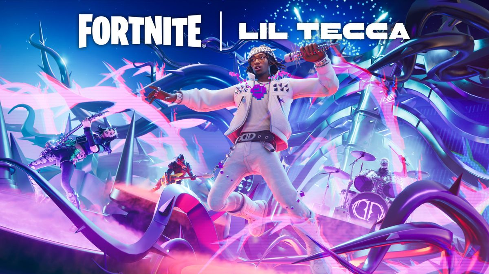
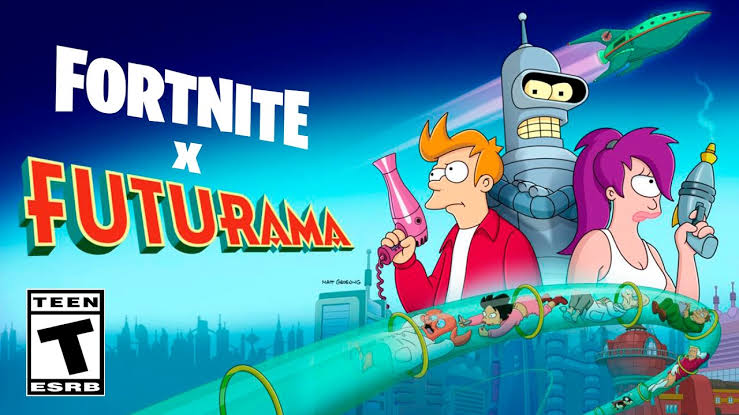
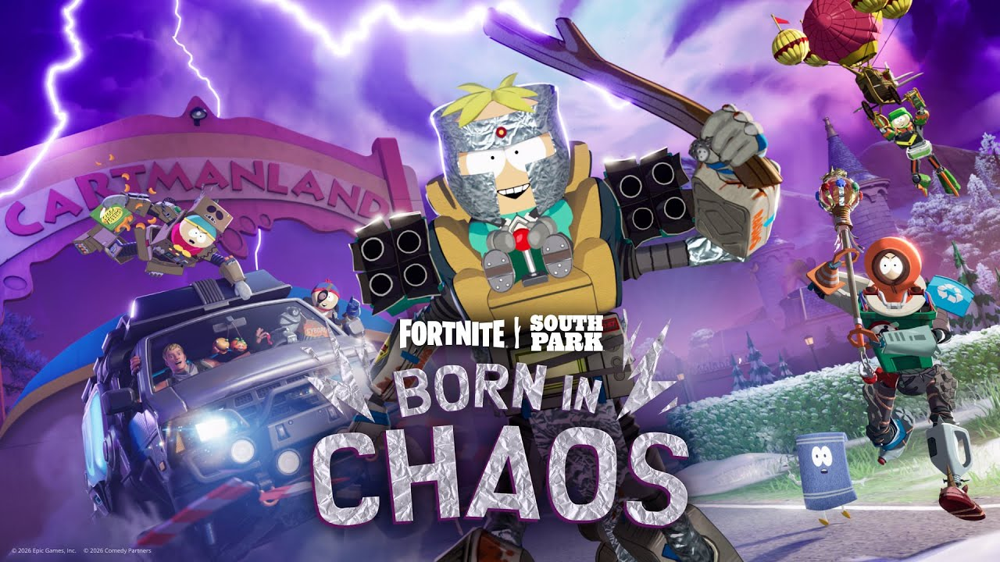
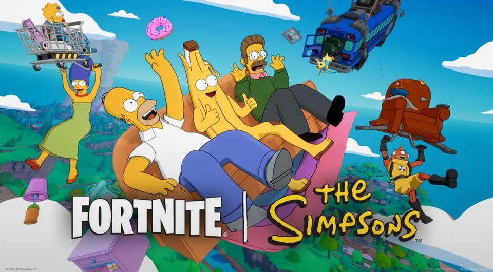

<!-- # **qFoldIT** is a ‭«***Universal Builder & Gamifier of Scientific***». -->  <!-- **Gamified Quantum Molecular Drug Design for Global Science** -->
<!-- ****qFoldIT**** is a ‭«***Universal Builder & Gamifier of Scientific Problems***». -->


<h1> <div align="center">qFoldIT</div> </h1>

<a href="https://www.cell.com/trends/biotechnology/abstract/S0167-7799(22)00034-8">
 
</a>
<a href="https://www.bakerlab.org/">
 
</a> 

```
                            CONTROL PLANE
                                  |
          +-----------------------+-----------------------+
          |                       |                       |
   Scientific Registry     Experience Compiler      Trust / Provenance
   (verified MCP servers)  (pattern -> UAG)          (IP + source gating)
          |                       |                       |
          +-----------------------+-----------------------+
                                  |
                         Canonical Contracts
                                  |
             +--------------------+--------------------+
             |                    |                    |
      Canonical Actions    Capability Registry   Universal Assembly
      (semantic verbs)      (native/adapter/        Graph (UAG)
                           composed/emulated/     (portable scene +
                             unsupported)         interaction state)
             |                    |                    |
             +--------------------+--------------------+
                                  |
                            Routing Policy
                                  |
             +--------------------+--------------------+--------------------+
             |                    |                    |                    |
          UEFN Adapter        Unity Adapter       UNIGINE Adapter      Web Adapter
             |                    |                    |                    |
          UEFN-TOOLBELT        UNITY-TOOLBELT      UNIGINE-TOOLBELT    WEB-TOOLBELT
             |                    |                    |                    |
           UEFN/UE               UNITY               UNIGINE             Browser
```

<h1 align="center">
  <a href="https://create.fortnite.com/join/2f8d8693-4fbf-4a21-ac3d-9a97efd6ed97/2b51a870-d7ef-40f8-8e57-73273fa578b3">JOIN qFoldIT AT FORTNITE</a>
</h1>

<h1 align="center">
  <a href="https://play.fold.it/">PLAY FoldIT</a>
</h1>

<a href="https://github.com/qfoldit/UEFN-TOOLBELT">
 
</a>

<a href="https://github.com/qfoldit/UEFN-TOOLBELT">
 
</a>

<a href="https://create.fortnite.com/join/2f8d8693-4fbf-4a21-ac3d-9a97efd6ed97/2b51a870-d7ef-40f8-8e57-73273fa578b3">
 
</a>
<a href="https://youtu.be/1JeDko5jflY?si=BhuiCp_qxjg6JPzp">
 
</a>
<a href="https://youtu.be/1JeDko5jflY?si=BhuiCp_qxjg6JPzp">
 
</a>
<a href="https://www.youtube.com/watch?v=CcJsHlwFWYE">
 
</a>
<a href="https://youtu.be/3S2pokF2xz4?si=DbMGsx7qGTUwUsAw">
 
</a>
<a href="https://youtu.be/13QoRmIFK0c?si=KSJkl-zToafwGt7D">
 
</a>
<a href="https://youtu.be/mqQDlH9ztL4?si=AT5_dv2jmVcYns67">
 
</a>
<a href="https://www.youtube.com/watch?v=NP6BfKT1VAQ">
 
</a>
<a href="https://create.fortnite.com/join/2f8d8693-4fbf-4a21-ac3d-9a97efd6ed97/2b51a870-d7ef-40f8-8e57-73273fa578b3">
 
</a>
<a href="https://create.fortnite.com/join/2f8d8693-4fbf-4a21-ac3d-9a97efd6ed97/2b51a870-d7ef-40f8-8e57-73273fa578b3">
 
</a>
<a href="https://youtu.be/cUbe2nmJNCI?si=8DYWOGewKnE4LdbO">
 
</a>       
<a href="https://www.youtube.com/watch?v=Ei88G2Txiug">
 
</a>

<h1> <div align="center">Real science. Real play.</div> </h1>

qFoldIT turns real scientific discovery into playable experiences. Fold a protein. Search for a quantum ground state. Grow a plant from first principles of light and nutrients. Screen a molecule for safety before it ever reaches a lab bench.

Every level you play is generated from an actual scientific computation — not a script, not a guess. If the science isn't real, the level doesn't ship.

---

<h1> <div align="center"> Play it where you already play</div> </h1>

qFoldIT experiences run inside the game engines millions of players already use – and now also in your browser:

- **Fortnite / UEFN**
- **Unity**
- **UNIGINE**
- **Web (browser)** – via Three.js / WebGL / WebGPU

<h1> <div align="center"> One scientific idea, built once, playable everywhere. </div> </h1>

<h1> <div align="center"> What's live today </div> </h1>

- 🧬 **Protein Folding Construction** — fold real proteins, level by level
- ⚛️ **Quantum Ground-State Portal** — explore energy landscapes through a quantum search
- 🧩 **HP-Lattice Spatial Puzzle** — a spatial puzzle built on real lattice-protein folding
- 🛡️ **ADMET Safety Strategy** — screen molecules for safety the way real researchers do
- 🌱 **Procedural Growth (L-Systems)** — grow a plant shaped by real light and nutrient rules

All of these experiences are available across all supported platforms, including the web via the new **WEB-TOOLBELT**.

More scientific domains are on the way — each one only goes live once it's backed by a verified scientific engine.

<h1> <div align="center"> Our promise </div> </h1>

We don't fake the science. A qFoldIT level is only themed, titled, and released once it's connected to a real, working scientific result. If we don't have that yet, we don't ship the skin — we keep building instead.

<h1> <div align="center"> Engine adapters </div> </h1>

Each platform gets its own adapter (toolbelt) that translates the canonical Universal Assembly Graph (UAG) into native objects and interactions. The table below gives an overview of the current adapter inventory:

| Engine   | Tools        | Categories   | Avg. Tools per Category |
|----------|--------------|--------------|-------------------------|
| **UEFN** | 358+         | 55+          | ~6.5                    |
| **UNITY**| 105          | 24           | 4.25                    |
| **UNIGINE**| 84         | 23           | ~3.64                   |
| **Web**  | N/A (runtime)| N/A          | —                       |

> The **WEB-TOOLBELT** is a browser-native runtime that uses Three.js for 3D rendering, Rapier.js for physics, and a **WebMCP bridge** to communicate with the same MCP servers as the other adapters. It deliberately does not vendor any scientific solver – it consumes canonical scientific state identically to the engine toolbelts, ensuring full parity across all platforms. WEB-TOOLBELT is architected to integrate with external scientific and educational work, acknowledging:
> - **Neil Voss / VossLab** and the **Virtual-Lab-Simulation** project as an upstream reference for browser-based laboratory simulation and scientific 3D interaction.
> - **Silvia Holler** and the **DropleX** work as the reference observation/tracking pipeline for video analysis and active-matter experiments.

The combined tool count across the three editor‑side toolbelts is **547+ tools / 102+ categories**; the web runtime adds a separate, lightweight implementation focused on high‑performance rendering and interaction in the browser.

```
                     qFoldIT
                        │
                   Universal UAG
                        │
        ┌───────────────┼────────────────┬───────────────┐
        │               │                │               │
        ▼               ▼                ▼               ▼
      UEFN            UNITY           UNIGINE           Web
   358+ / 55+       105 / 24        84 / 23        (runtime)
        │               │                │               │
        └───────────────┼────────────────┴───────────────┘
                        │
             547+ TOOLS / 102+ CATEGORIES + WEB RUNTIME
```

```
                         qFoldIT
                            │
        ┌───────────────────┼───────────────────┬───────────────┐
        │                   │                   │               │
      SCIENCE           GAME DESIGN           TRUST            WEB
        │                   │                   │               │
        ▼                   ▼                   ▼               ▼
 Scientific MCP       Deterministic        Provenance /    WEB-TOOLBELT
   Registry             Game Design        Compliance     (Three.js,
        │                   │                   │         Rapier.js,
        └───────────────────┼───────────────────┘         WebMCP)
                            │
                            ▼
                       UAG / OpenUSD
                            │
                            ▼
                     UEFN-TOOLBELT
                            │
                            ▼
                    Interactive Science
                            │
                            ▼
                    Human + AI Discovery
```
```
                       qFoldIT
               SCIENTIFIC RUNTIME
                         │
       ┌─────────────────┼──────────────────┬─────────────┐
       │                 │                  │             │
 SCIENCE CONTROL    EXPERIENCE        TRUST / IP        WEB
       │                 │                  │             │
 MCP Registry      Canonical State     Provenance    WEB-TOOLBELT
       │                 │                  │             │
       └─────────────────┼──────────────────┴─────────────┘
                         │
                ENGINE ADAPTER API
                         │
       ┌─────────────────┼──────────────────┬─────────────┐
       │                 │                  │             │
       ▼                 ▼                  ▼             ▼
     UEFN              UNITY             UNIGINE         Web
   TOOLBELT           TOOLBELT           TOOLBELT     (runtime)
       │                 │                  │             │
       ▼                 ▼                  ▼             ▼
    Fortnite           Unity             UNIGINE      Browser
```

---

### 🌐 Unified Metaverse Runtime (UE6 Architecture)

Under **Unreal Engine 6 (UE6)** framework, Epic Games unifies licensing conditions and developer terms across all deployment tracks, blending the boundaries between standalone application development (UE) and meta-environments (UEFN). 

Architecture provides complete deployment flexibility: the exact same **Universal Assembly Graph (UAG)** and **Verse / Scene Graph** configurations can run as an isolated, standalone scientific simulator with custom assets locally, or deploy seamlessly as a fully compliant, pre-validated interactive world inside the **LEGO Fortnite** ecosystem using native asset referencing—adapting to target compliance rules on-the-fly without codebase refactoring.

---

ℹ️ IP Compliance Notice: The Rick and Morty franchise in the LEGO style within Fortnite is governed by a private tripartite B2B intellectual property (IP) sublicensing agreement between Warner Bros. Discovery (WBD / Licensor), Epic Games (Licensee), and LEGO System A/S (Brand Owner and Co-creator of the mode). Within this pre-validated ecosystem, qFoldIT operates strictly as a structural automation layer—translating scientific datasets into platform-native Verse code via autonomous MCP servers and the Universal Assembly Graph (UAG) without importing or modifying proprietary assets.

[Fortnite Kombat](https://youtu.be/ckHzHy-c42E?si=V7O9u8G1rUn1NxDu)

[LEGO® / FORTNITE® Cinematic Trailer](https://www.youtube.com/watch?v=GeKTrjGdJ2E)

[LEGO® ELEMENTS and LEGO® STYLES come to  FORTNITE® Creative and UEFN](https://youtu.be/OHZwIdmgoCI?si=0EGJzrKTFhrxnGJc)

[EPIC GAMES® / FORTNITE® | Rick And Morty in UEFN Fortnite](https://www.youtube.com/watch?v=NP6BfKT1VAQ)


<!--

```python
"""
https://github.com/qfoldit/UEFN-TOOLBELT/qfoldit/science/presets.py
============================
Structural Automation Layer -- abstract-token scientific presets.

Full preset list (10 presets, aligned with the gamification plan):
  1. l_systems               – Snoop Dogg
  2. drug_design             – Lil Peep (tribute)
  3. genetic_patterns        – MrBeast
  4. kinetics_resistance     – Lewis Hamilton
  5. protein_engineering     – Keanu Reeves
  6. astro_membrane          – Travis Scott
  7. quantum_docking         – Rick and Morty
  8. sequencing              – Eminem
  9. computer_vision         – Scarlett Johansson
 10. dopamine_receptor       – Lil Tecca
"""

from __future__ import annotations

import hashlib
import math
from dataclasses import asdict, dataclass
from typing import Any

from qfoldit.science.gamedesign import TeamRole
from qfoldit.science.mcp_registry import ScienceMCPRegistry
```

-->

[WARNER BROTHERS® Rules](https://legal.wbgames.com/wbgames-legal/epic/eula/eula_epic_en_NZ.html)

[LEGO® Rules](https://dev.epicgames.com/documentation/fortnite/lego-brand-rules-in-fortnite)

[EPIC GAMES® / FORTNITE® Rules](https://dev.epicgames.com/documentation/fortnite/lego-brand-rules-in-fortnite)

---

*Built by Ocean Bennett — [@undergroundrap](https://github.com/undergroundrap) — for the 2026 UEFN Python wave.*
*qFoldIT extension merged from the qFoldIT team — see [qFoldIT Trust & Compliance Layer](https://github.com/qfoldit/UEFN-TOOLBELT/blob/main/README.md#qfoldit-trust--compliance-layer).*

All LEGO visualisations published on ideas.lego.com on behalf of qFoldIT undergo review for MPNC and LEGO Authenticity before upload. Reviewer profile: **Vosslab** (Dr. Neil Voss) — qFoldIT Owner; scientific-computing contributor; Tetrisphere creator; LEGO Ideas member/LEGO artist.


# Contact

GitHub Organization:

qFoldIT@gmail.com <br>
https://github.com/qfoldit
