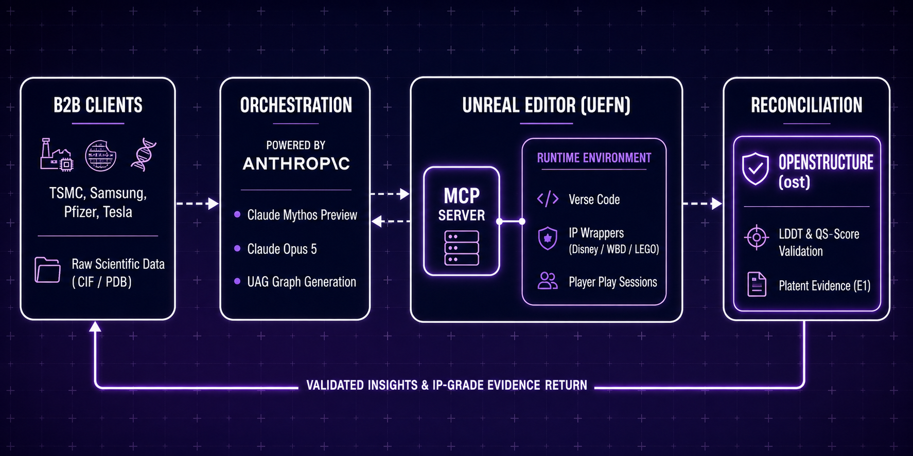
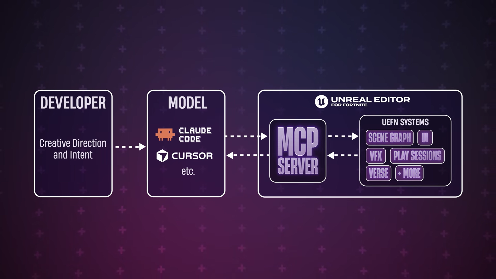
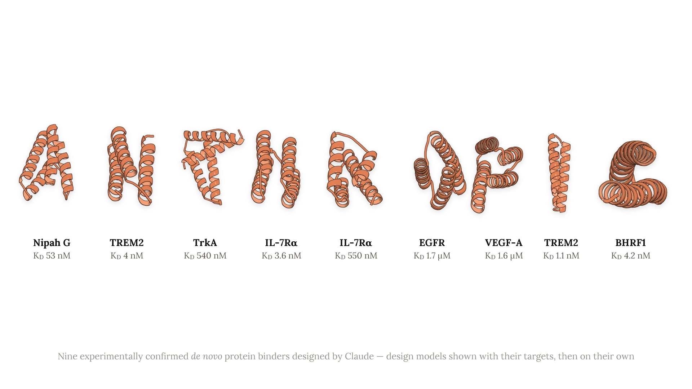
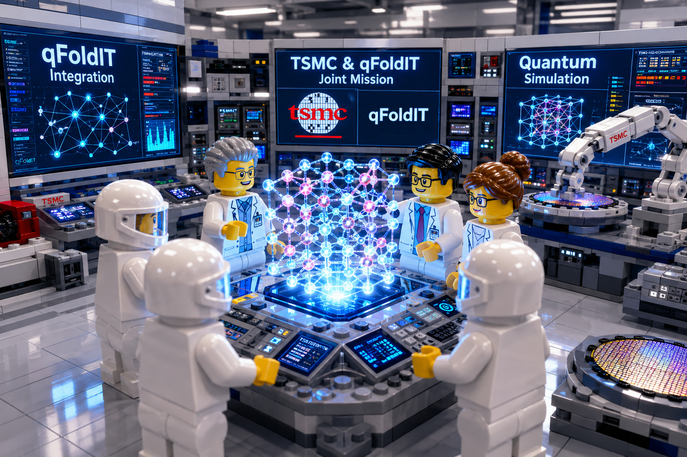

# qFoldIT

<a href="https://www.cell.com/trends/biotechnology/abstract/S0167-7799(22)00034-8">
 
</a>



<h2 align="center"> <a href="https://dev.epicgames.com/documentation/fortnite/uefn-mcp">UEFN MCP</a> </h2>

<a href="https://www.youtube.com/watch?v=hZHjZVVjEsE">
 
</a> 

<h2 align="center"> <a href="https://www.anthropic.com/research/Claude-accelerates-protein-design">Anthropic protein design</a> </h2>

[](assets/ANTHROPIC_v4_max_1920x1080.mp4)
<p align="center">
  
</p>
<a href="https://create.fortnite.com/join/2f8d8693-4fbf-4a21-ac3d-9a97efd6ed97/2b51a870-d7ef-40f8-8e57-73273fa578b3">
 
</a>
<a href="https://create.fortnite.com/join/2f8d8693-4fbf-4a21-ac3d-9a97efd6ed97/2b51a870-d7ef-40f8-8e57-73273fa578b3">
 
</a>
<a href="https://create.fortnite.com/join/2f8d8693-4fbf-4a21-ac3d-9a97efd6ed97/2b51a870-d7ef-40f8-8e57-73273fa578b3">
 
</a>

<h1 align="center">qFoldIT — Science, Compiled into Missions</h1>

<p align="center"><strong>Contract-first scientific computing and human-in-the-loop discovery across MCP, UAG, simulation and interactive runtimes.</strong></p>

<p align="center">
  <a href="https://github.com/qfoldit">GitHub Organization</a> ·
  <a href="https://qfoldit.github.io/">Public State & Project Site</a> ·
  <a href="https://github.com/qfoldit/IP-valuation-registry">IP & Evidence Registry</a> ·
  <a href="https://github.com/qfoldit/IP-valuation-registry/blob/main/QFOLDIT-INTEGRATED-PLATFORM-ARCHITECTURE-2026-08-21.md">Canonical Architecture</a>
</p>

---

## What qFoldIT is

qFoldIT is a **scientific mission platform** that converts research and industrial objectives into governed, executable and auditable human/AI missions.

The platform separates scientific authority from presentation, gameplay, learning and commercial policy:

```text
Scientific / Industrial Objective
        ↓
Mission Contract
        ↓
Capability Profile
        ↓
Mission Router
        ↓
Mission Compiler
        ↓
UAG / Scientific Object Model
        ↓
Runtime Adapter
        ↓
Human + AI Search
        ↓
Submission / Event
        ↓
CAMEO Reconciliation
        ↓
Scientific Validation
        ↓
Evidence / Contribution Record
        ↓
STATE Projection
        ↓
Enterprise Deliverable
```

The result is not merely a game level. It is a **validated scientific workflow** that can be rendered as an interactive experience when that is the best interface for the mission.

## qFoldIT in Claude / MCP environments

qFoldIT is designed to operate as a **scientific capability fabric for MCP-compatible agents**, including Claude-based research workflows.

The correct boundary is:

```text
Claude / Scientific Agent
        ↓
MCP Scientific Tools & Services
        ↓
qFoldIT Mission Contract
        ↓
UAG / Scientific Object Model
        ↓
Mission Compiler / Runtime Adapter
        ↓
Execution
        ↓
Scientific Validator
```

Claude is an orchestration and reasoning interface. **Scientific truth remains external to the conversational layer and is established by the configured scientific validators and customer-authorized reference boundaries.**

qFoldIT therefore does not claim that an LLM response is itself a scientific result, nor that an interactive runtime can redefine scientific authority.

## Core architecture

| Layer | Function | Representative qFoldIT surfaces |
|---|---|---|
| Governance | Rights, provenance, contracts, evidence | `.github`, `.github-private`, `IP-valuation-registry` |
| Enterprise Control Plane | Customer objectives and mission lifecycle | `CORPORATE_APP` |
| Compilation | Routing and deterministic mission compilation | `CORPORATE_APP`, conformance fixtures |
| Scientific Object Model | Canonical scientific/world representation | `Scientific-Object-Schema`, UAG |
| Scientific MCP Mesh | Machine-readable tools and agents | `qFold-MCP`, `Protein-MCP`, `Protein-Design-MCP`, `Atomic-MCP`, scientific skills |
| Validation Fabric | Authoritative scientific scoring | `OPENSTRUCTURE`, domain validators, quantum services |
| Reconciliation | Runtime submission → scientific evidence | `CAMEO-REALTIME-VALIDATION`, `INDUSTRIAL-CAMEO` |
| Runtime Mesh | Engine/browser/desktop execution | UEFN, Unity, UNIGINE, Web, Standalone |
| Learning | Strategy/coaching/compute optimization | `learning-policy`, gameplay optimization, QOS |
| Attention / Presentation | Participation and distribution | original/licensed narrative and game layers |
| Commercial Policy | Eligibility, rights, rewards and customer policy | enterprise policy layer |
| STATE | Safe public/organizational projection | `qfoldit.github.io` |

## Canonical contracts

The organization is moving toward explicit, versioned boundaries rather than direct application-to-engine coupling.

```text
qfoldit.mission/1.0
qfoldit.mission-routing/1.0
qfoldit.mission-compiled/1.0
qfoldit.uag/0.1
qfoldit.event/1.0
qfoldit.submission/1.0
qfoldit.evidence/1.0
qfoldit.learning-policy/1.0
```

These contracts let scientific services, enterprise applications, game engines, simulation environments and future runtimes evolve independently.

## Runtime adapters

One scientific representation can be delivered through multiple interaction surfaces:

```text
                    Canonical UAG / Scientific State
                                │
          ┌─────────────────────┼─────────────────────┐
          │                     │                     │
        UEFN                  Unity                 UNIGINE
          │                     │                     │
   UEFN-TOOLBELT         UNITY-TOOLBELT       UNIGINE-TOOLBELT
          │                     │                     │
          └─────────────────────┼─────────────────────┘
                                │
                          WEB-TOOLBELT
                                │
                         STANDALONE APP
```

Runtime adapters are **execution surfaces, not scientific authorities**. The Web runtime intentionally consumes canonical state rather than embedding heavyweight scientific solvers; the Standalone runtime provides an offline-first desktop experience with local interaction and MCP bridging. Existing adapter work explicitly tracks third-party licenses and attribution.

## Scientific validation

qFoldIT's current OpenStructure integration establishes a server-side scientific validation boundary with protected references and native structural scoring.

```text
CORPORATE_APP
      ↓ authenticated server-side request
OPENSTRUCTURE qFoldIT service
      ↓
OpenStructure / `ost`
      ↓
LDDT / local-LDDT / QS-score
      ↓
ValidationResult
      ↓
validation.completed + audit evidence
```

A failed validator does not become a score by fallback logic. This fail-closed rule is fundamental to the qFoldIT evidence model.

## CAMEO and three clocks

qFoldIT distinguishes:

1. **Authoring clock** — target creation and mission compilation.
2. **Runtime clock** — interaction and event capture.
3. **Reconciliation clock** — external scientific validation and evidence publication.

For UEFN this distinction is essential: live Verse execution is not treated as a direct arbitrary-network scientific client. The intended model is runtime interaction → session publication → external reconciliation → scientific validation.

## Human + AI discovery

qFoldIT treats players and agents as search participants rather than as sources of scientific truth.

```text
Mission State
+ Player / Agent State
+ Historical Outcomes
+ Compute State
        ↓
Learning Policy
        ↓
Decision / Coaching
        ↓
Runtime Outcome
        ↓
Validation
        ↓
Evidence
        ↓
Policy Update
```

The target metric is **validated scientific contribution density**, not raw playtime.

## Attention Capture

Game design, narrative, cultural presentation and interactive distribution are first-class platform capabilities, but they remain downstream of mission and scientific authority:

```text
Original / Licensed Presentation
        ↓
Quest Object
        ↓
Scientific Mission
        ↓
Human Search
        ↓
Validation
        ↓
Contribution
```

Third-party brands, entertainment franchises and external ecosystems remain governed by their own licenses and contracts. qFoldIT does not claim ownership of upstream or partner IP merely by integrating with it.

## Current scientific mission domains

qFoldIT's mission architecture is designed for:

- protein and peptide design;
- structural biology and molecular modeling;
- drug discovery and ADMET;
- synthetic biology and L-systems;
- materials and crystal search;
- batteries and energy storage;
- semiconductors and AI hardware;
- quantum computing and hybrid optimization;
- aerospace and space science;
- energy, hydrogen and CCUS;
- mining and resource processing;
- industrial engineering and process optimization;
- scientific software and cloud AI.

## Evidence discipline

qFoldIT distinguishes:

- **E1** — verified implementation evidence;
- **E2** — strong architecture/product evidence;
- **E3** — design, roadmap or option evidence;
- **EX** — third-party/upstream evidence.

Repository size, external ecosystem reach, prospect lists, TAM, gameplay hypotheses and third-party scientific achievements are not automatically qFoldIT-owned value or revenue evidence.

## Visual and interaction heritage

<a href="https://www.cell.com/trends/biotechnology/abstract/S0167-7799(22)00034-8"></a>

<a href="https://www.bakerlab.org/"></a>

<a href="https://github.com/qfoldit/UEFN-TOOLBELT"></a>

<a href="https://create.fortnite.com/join/2f8d8693-4fbf-4a21-ac3d-9a97efd6ed97/2b51a870-d7ef-40f8-8e57-73273fa578b3"></a>

## Explore

- [qFoldIT GitHub organization](https://github.com/qfoldit)
- [Public project site and STATE](https://qfoldit.github.io/)
- [Canonical Integrated Platform Architecture](https://github.com/qfoldit/IP-valuation-registry/blob/main/QFOLDIT-INTEGRATED-PLATFORM-ARCHITECTURE-2026-08-21.md)
- [IP, provenance and valuation registry](https://github.com/qfoldit/IP-valuation-registry)
- [UEFN / Fortnite experience](https://create.fortnite.com/join/2f8d8693-4fbf-4a21-ac3d-9a97efd6ed97/2b51a870-d7ef-40f8-8e57-73273fa578b3)
- [FoldIT](https://play.fold.it/)
- [MCP standard](https://modelcontextprotocol.io/)

## Contact

**qFoldIT**  
qFoldIT@gmail.com  
https://github.com/qfoldit

> Built on the open Model Context Protocol (MCP) standard.
> 
> Scientific authority remains with validated scientific services and authorized reference boundaries.

## Historical profile material

The previous organization profile, including its complete historical image set, contact information, links, MPNC material and presentation examples, is retained verbatim in [`profile/README-LEGACY-2026-08-21.MD`](./README-LEGACY-2026-08-21.MD).
